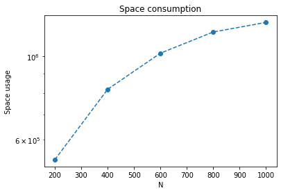

# Lin n-of-N implementation

## Algorithm

### Sketch construction

### Query quantiles

In this implemenation:
- `GKArray` is taken from [ddsketch on github](https://github.com/DataDog/sketches-py/blob/v0.1/gkarray/gkarray.py)
- Query step 2 and step 3 are replaced with `query` method in `GKArray`

## Consumption

### Space consumption

- `SAMPLE_SIZE = 1000`
- `N = 200, 400, 600, 800, 1000`

**General trend of this graph is in line with the paper**

### Query performance

[!Query performance](./img/query.png)

- `SAMPLE_SIZE = 1000`
- `N = 800`
- `e = 0.01, 0.025, 0.05, 0.075, 0.1`
- One query: `0.5-quantile`, `n = 400`

**General trend of this graph is in line with the paper**

## References

[1] X. Lin, H. Lu, J. Xu, and J. X. Yu, ‘‘Continuously maintaining quantile summaries of the most recent N elements over a data stream,’’ in Proc. 20th Int. Conf. Data Eng. (ICDE), Boston, MA, USA: Mar./Apr. 2004, pp. 362–373.

[2] [ddsketch implemtation of GKArray](https://github.com/DataDog/sketches-py/blob/v0.1/gkarray/gkarray.py)